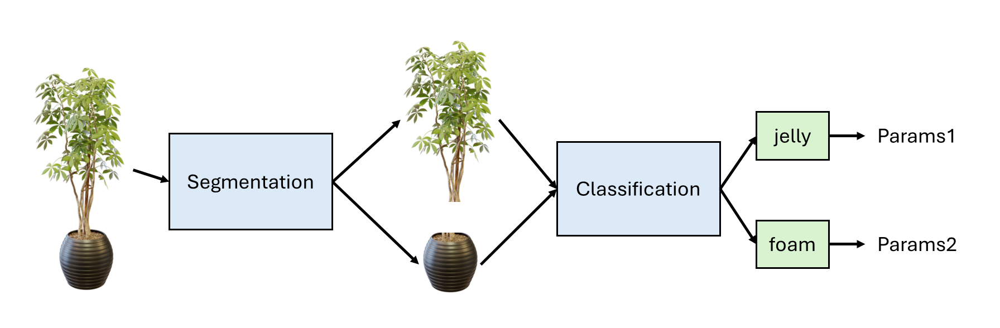
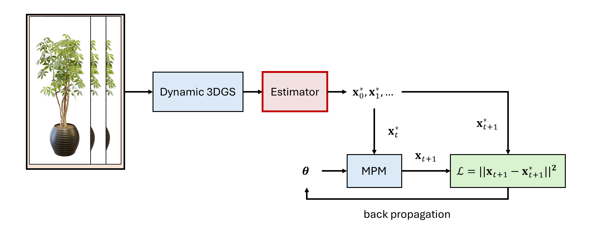

[](https://classroom.github.com/a/SdXSjEmH)
# EV-HW3: PhysGaussian

## 1. How to Run the Code
### Getting the Code from the Official PhysGaussian GitHub Repository
Download the official codebase using the following command:
```
git clone https://github.com/XPandora/PhysGaussian.git
```

### Environment Setup
Navigate to the "PhysGaussian" directory and follow the instructions under the "Python Environment" section in the official README to set up the environment.

### Running the Simulation
Follow the "Quick Start" section and execute the simulation scripts as instructed. Make sure to verify your outputs and understand the role of physics constraints in the generated dynamics.

### Custom Configurations
The modified configuration files are located in the `config` directory. Simulation on different materials can be run by using these configurations.

## 2. Simulation of Different Materials
The simulation of different materials are ran on the ficus model provided in the official PhysGaussian repository. Each material has its own configuration settings to simulate the desired physical properties. If the configuration is set improperly, the deformation will be abnormal and violate the simulation constraints. As a result the simulation to fail with an error.

The materials can be grouped into 3 categories based on their configuration:
1. Jelly and Plasticine: The original configurations for the ficus model. Can be used to simulate the ficus in the wind.
2. Sand and Snow: The configurations that can make the ficus model look like sand or snow and collapse to the ground.
3. Metal and Foam: The configurations that can simulate the ficus model being twisted and deformed like flexible metal or foam.

The configurations and the simulation results are shown below:
### Jelly and Plasticine
No changes are needed for the ficus model to simulate jelly and plasticine. The original configuration is used.
<table>
  <tr>
    <td align="center"><strong>Jelly</strong></td>
    <td align="center"><strong>Plasticine</strong></td>
  </tr>
  <tr>
    <td></td>
    <td></td>
  </tr>
</table>

The two materials behaves similarly, with jelly having a slightly stronger damping effect.

### Sand and Snow
To simulate the ficus model as sand or snow, the configurations are modified as follows:
- Add Gravity `"g": [0,0,-9.8]`.
- Add `particle_filling` to fill the interior of the model with particles.
- Change the boundary condition type to `release_particles_sequentially` along with a `surface_collider` to allow particles to fall on the ground.
<table>
  <tr>
    <td align="center"><strong>Sand</strong></td>
    <td align="center"><strong>Snow</strong></td>
  </tr>
  <tr>
    <td></td>
    <td></td>
  </tr>
</table>

Compared to sand, snow tends to clump together when falling, resulting in a smaller and denser pile on the ground.
### Metal and Foam
To simulate the ficus model as metal or foam, the configurations are modified as follows:
- Add `particle_filling` to fill the interior of the model with particles.
- Change the boundary condition type to `enforce_particle_velocity_rotation` to twist the model by rotating the particles.
<table>
  <tr>
    <td align="center"><strong>Metal</strong></td>
    <td align="center"><strong>Foam</strong></td>
  </tr>
  <tr>
    <td></td>
    <td></td>
  </tr>
</table>

The difference between the two materials is hard to spot in this simulation.
## 3. Parameter Adjustments
The following parameters are tested with different values to assess their impact on the **jelly** and **sand** simulation results.
- `n_grid` (default: 50)
- `substep_dt` (default: 1e-4)
- `grid_v_damping_scale` (default: 0.9999)
- `softening` (default: 0.1)

Only one parameter is adjusted at a time while the others are set to their default values. The PSNR to the default setting is calculated for each parameter adjustment. The results are shown below:
### Jelly Simulation
#### Grid Number
PSNR:
| `n_grid` | PSNR |
|----------|------|
| 5       | 38.08 dB  |
| 25       | 38.17 dB  |
| 50       | default value |

Simulation:
<table>
  <tr>
    <td align="center"><strong>n_grid = 5</strong></td>
    <td align="center"><strong>n_grid = 25</strong></td>
    <td align="center"><strong>n_grid = 50 (default)</strong></td>
  </tr>
  <tr>
    <td></td>
    <td></td>
    <td></td>
  </tr>
</table>

Findings:

From the simulation results, we can observe that with `n_grid` being too small, the model barely moves. This is likely due to the insufficient number of grid points to accurately capture the dynamics of the model. On the other hand, with `n_grid` being too large, the simulation will take up too much memory and fail. Therefore, the default value of `n_grid = 50` is a good balance between performance and accuracy.

#### Substep Time
PSNR:
| `substep_dt` | PSNR |
|--------------|------|
| 5e-5         | 38.19 dB  |
| 8e-5         | 38.96 dB  |
| 10e-5        | default value |

Simulation:
<table>
  <tr>
    <td align="center"><strong>substep_dt = 5e-5</strong></td>
    <td align="center"><strong>substep_dt = 8e-5</strong></td>
    <td align="center"><strong>substep_dt = 10e-5 (default)</strong></td>
  </tr>
  <tr>
    <td></td>
    <td></td>
    <td></td>
  </tr>
</table>

Findings:

From the simulation results, we can observe that smaller `substep_dt` leads to more subtle movement of the model. This is likely caused by the implementation of the simulation. The damping of the particles is applied at each substep via the `add_damping_via_grid` function, which scales the grid velocity by a damping factor. A smaller `substep_dt` means that the damping is applied more frequently, resulting in a more subtle movement of the model. A better implementation can adjust the damping factor based on the `substep_dt` to achieve a more consistent damping effect by decoupling the damping from the substep time. 

Another finding is that a smaller `substep_dt` can lead to longer time for the simulation to complete, while a larger `substep_dt` can lead to unstable simulation results and cause errors. Therefore, the value needs to be well chosen to balance the computation time and the stability of the simulation.

#### Grid Velocity Damping Scale
PSNR:
| `grid_v_damping_scale` | PSNR |
|------------------------|------|
| 0.9       | 38.12 dB  |
| 0.9999   | default value  |
| 1.5 | 37.65 dB  |

Simulation:
<table>
  <tr>
    <td align="center"><strong>grid_v_damping_scale = 0.9</strong></td>
    <td align="center"><strong>grid_v_damping_scale = 0.9999</strong></td>
    <td align="center"><strong>grid_v_damping_scale = 1.0</strong></td>
  </tr>
  <tr>
    <td></td>
    <td></td>
    <td></td>
  </tr>
</table>

Findings:

The effect of `grid_v_damping_scale` is straightforward. It applies a scale to the grid velocity every step via the function `add_damping_via_grid`. A smaller value leads to a more subtle movement of the model, while a larger value leads to a more violent movement of the model. In addition, the upperbound of the value is 1.0, which is ensured in the code to prevent instability.

#### Softening
PSNR:
| `softening` | PSNR |
|-------------|------|
| 0.01        | 76.32 dB  |
| 0.1         | default value |
| 0.5         | 76.44 dB  |

Simulation:
<table>
  <tr>
    <td align="center"><strong>softening = 0.01</strong></td>
    <td align="center"><strong>softening = 0.1 (default)</strong></td>
    <td align="center"><strong>softening = 0.5</strong></td>
  </tr>
  <tr>
    <td></td>
    <td></td>
    <td></td>
  </tr>
</table>

Findings:

The effect of `softening` is really subtle and can barely be observed in both the PSNR and the simulation results.

### Sand Simulation
#### Grid Number
PSNR:
| `n_grid` | PSNR |
|----------|------|
| 5       | 35.80 dB  |
| 25       | 40.83 dB  |
| 50       | default value |

Simulation:
<table>
  <tr>
    <td align="center"><strong>n_grid = 5</strong></td>
    <td align="center"><strong>n_grid = 25</strong></td>
    <td align="center"><strong>n_grid = 50 (default)</strong></td>
  </tr>
  <tr>
    <td></td>
    <td></td>
    <td></td>
  </tr>
</table>

Findings:

Similar to the jelly simulation, the `n_grid` parameter controls the number of grid points used in the simulation. When the value is too small, the model fails to move due to insufficient grid points to capture the dynamics.

#### Substep Time
PSNR:
| `substep_dt` | PSNR |
|--------------|------|
| 5e-5         | 37.05 dB  |
| 8e-5         | 38.66 dB  |
| 10e-5        | default value |

Simulation:
<table>
  <tr>
    <td align="center"><strong>substep_dt = 5e-5</strong></td>
    <td align="center"><strong>substep_dt = 8e-5</strong></td>
    <td align="center"><strong>substep_dt = 10e-5 (default)</strong></td>
  </tr>
  <tr>
    <td></td>
    <td></td>
    <td></td>
  </tr>
</table>

Findings:

The effect of `substep_dt` is hard to observe in the sand simulation. Therefore, as long as the value is not too large to crash the simulation, it may not be necessary to use very small values.

#### Grid Velocity Damping Scale
PSNR:
| `grid_v_damping_scale` | PSNR |
|------------------------|------|
| 0.9       | 37.05 dB  |
| 0.9999   | default value  |
| 1.5 | 42.84 dB  |

Simulation:
<table>
  <tr>
    <td align="center"><strong>grid_v_damping_scale = 0.9</strong></td>
    <td align="center"><strong>grid_v_damping_scale = 0.9999</strong></td>
    <td align="center"><strong>grid_v_damping_scale = 1.0</strong></td>
  </tr>
  <tr>
    <td></td>
    <td></td>
    <td></td>
  </tr>
</table>

Findings:

From `grid_v_damping_scale=0.9`, we can see if the scale is too small, the particles become very sticky and the model only shorten slightly rather than collapsing to the ground.

#### Softening
PSNR:
| `softening` | PSNR |
|-------------|------|
| 0.01        | 47.99 dB  |
| 0.1         | default value |
| 0.5         | 48.01 dB  |

Simulation:
<table>
  <tr>
    <td align="center"><strong>softening = 0.01</strong></td>
    <td align="center"><strong>softening = 0.1 (default)</strong></td>
    <td align="center"><strong>softening = 0.5</strong></td>
  </tr>
  <tr>
    <td></td>
    <td></td>
    <td></td>
  </tr>
</table>

Findings:

The softening parameter has a bigger impact on PSNR in the sand simulation compared to the jelly simulation. However, the effect is still subtle to human eye in the simulation results. Only the shading of some regions is slightly different if looking very closely.

### Conclusion
The effects of the parameters are summarized below:
| Parameter | Meaning | Effect |
|-----------|--------|--------|
| `n_grid` | The number of grid points used in the simulation | Too small values can lead to insufficient grid points to capture the dynamics, while too large values can lead to high memory usage |
| `substep_dt` | The time between each simulation step | Too large values can lead to instability, while too small values can lead to longer computation time |
| `grid_v_damping_scale` | The damping scale of grid velocity in every timestep | Small values make particles sticky or hard to move |
| `softening` | Too subtle to derive meaningful conclusions | The effect is subtle and hard to observe. |

Moreover, we can see that PSNR may not be able to distinguish the differences between moving too violently and not moving at all. Therefore, finding a better metric that captures the dynamics of the simulation may be helpful to evaluate the simulation results more effectively than pixel-wise metrics like PSNR.

## 4. Link to Simulation Results
All the simulation results are stored in the `results` directory and shown in the README. The video combining the simulation results of all materials is available at the following link:
[https://youtube.com/shorts/XQn7MWKe2SY](https://youtube.com/shorts/XQn7MWKe2SY).


## 5. BONUS: Automatic Generation of Material Parameters
I come up with two frameworks to automatically infer and generate the material parameters for the simulation:

### Automatic Infering Materials
The framework for inferring the material of an arbitrary object is shown below. First, if the object has multiple materials, it will be segmented into different parts. This segmentation can be done using models like PointNet++ on point clouds, or by directly segmenting Gaussians with models like Segment Any 3D Gaussians. Then, the render of each individual part is fed into an image classifier to infer the material of that part. Finally, predefined material parameters are selected based on the inferred material.

The limitation of this framework is that it only infers material properties from appearance, which may not be accurate if the object has a complex structure or if the material is not visually distinguishable. Nevertheless, it is a simple and straightforward approach that may work well in common scenarios.



### Automatic Generation of Material Parameters
When the classification confidence is too low, or when a new material is encountered, we can switch to a framework that automatically generates the material parameters. Denote the material parameters to be learned as $\mathbf{\theta}$. The MPM simulation can be written as:

```math
\mathbf{x}_t = f(\mathbf{x}_{t-1}, \mathbf{\theta}),
```

where $\mathbf{x}_t$ is the state of the simulation at time $t$, such as the position, velocity and deformation. $f$ is the MPM simulator. At first glance, we can render the simulation result $\mathbf{x}_t$ to a image $\mathbf{I}_t$ and calculate the loss between the rendered image and the ground truth frame $\mathbf{I}_t^*$:

```math
\mathcal{L}_I(\mathbf{\theta}) = || \mathbf{I}_t - \mathbf{I}_t^* ||^2.
```

Then, we use gradient descent to optimize $\mathbf{\theta}$. However, since $\mathbf{x}_t$ depends on the previous state $\mathbf{x}_{t-1}$, errors can accumulate over time before $\mathbf{\theta}$ is properly optimized, leading to unstable or meaningless gradients.

A possible way to resolve this problem is to first train a dynamic 3D Gaussian model. Since dynamic 3D Gaussians can effectively capture the motion trajectories of points, we can use them to represent the target particle states $\mathbf{x^*}_t$. Then, the simulation can be computed at time $t$ based on the observed dynamic 3D Gaussian at time $t-1$:

```math
\mathbf{x}_t = f(\mathbf{x^*}_{t-1}, \mathbf{\theta}).
```

Then the loss becomes:

```math
\mathcal{L}_\mathbf{x}(\mathbf{\theta}) = || \mathbf{x}_t - \mathbf{x}_t^* ||^2,
```

allowing us to optimize $\mathbf{\theta}$ with gradient descent without the problem of error accumulation. This framework is illustrated below.



The main concern with this framework is that the dynamic 3D Gaussian model is not physically aware. As a result, the Gaussians may not move or behave exactly like material points. Therefore, applying some modifications and constraints on the dynamic 3D Gaussian training process can be helpful to improve the quality of the representation. Additionally, dynamic 3D Gaussians lack properties such as deformation, which are essential in MPM. Therefore, an estimator, either analytically derived or learned from data, is needed to bridge the gap between the dynamic 3D Gaussian representation and MPM simulation.

These frameworks are just initial ideas for how to automatically generate material parameters for simulation. Real testing and iterative improvements are needed to evaluate their effectiveness in practice.

# Reference
```bibtex
@inproceedings{xie2024physgaussian,
    title     = {Physgaussian: Physics-integrated 3d gaussians for generative dynamics},
    author    = {Xie, Tianyi and Zong, Zeshun and Qiu, Yuxing and Li, Xuan and Feng, Yutao and Yang, Yin and Jiang, Chenfanfu},
    booktitle = {Proceedings of the IEEE/CVF Conference on Computer Vision and Pattern Recognition},
    year      = {2024}
}
```
